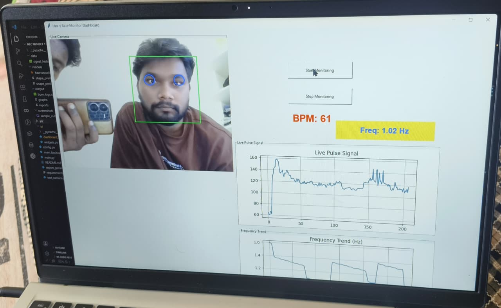

# Heart Rate Monitoring System

A real-time Heart Rate Monitoring System that detects and analyzes heart rate using computer vision and signal processing techniques. The application provides live pulse monitoring, frequency analysis, and visual feedback through an interactive dashboard.

## Features

* Real-time heart rate estimation
* Live pulse signal visualization
* Frequency analysis
* User-friendly dashboard interface
* Performance monitoring and status display

## Output Screenshot

